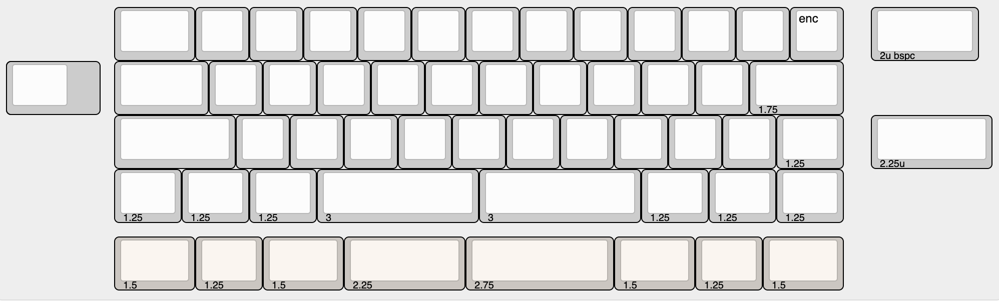
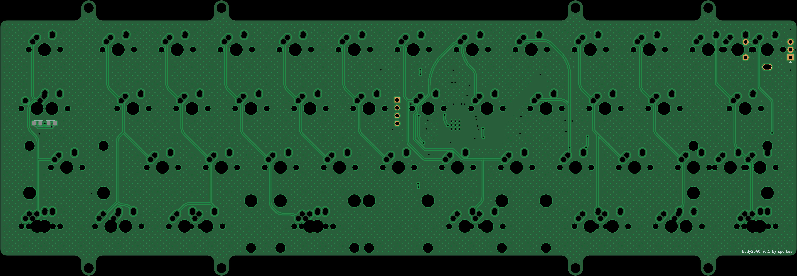
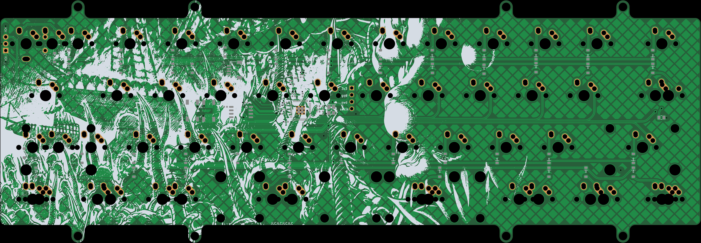

Opensource PCB for bully keyboard
------------------------------

This is an opensource pcb made for [Bully keyboard](https://mkh.works/#bully).

### Features
- No big bar
- MX/Alps
- Capslock LED
- EC11 encoder
- RP2040

### Supported layouts

### Production files
JLCPCB [production files](production) are provided. Component positions have been verified, but as always, do your own diligence when ordering.

### Firmware
- [qmk and vial config](https://github.com/sporkus/qmk_userspace/tree/main/keyboards/sporkus/bully2040)
- [pre-compiled vial](firmware/bully2040_vial.uf2)

### PCB

